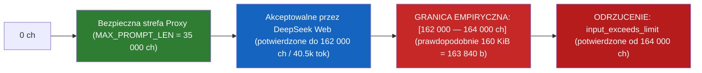

# Dowody Empiryczne, Pomiary Żywego Backend i Benchmarking

> **Poziom dowodowy:** Najwyższy (Determinizm 1:1 na bitach).
> Wszystkie wnioski w tym dokumencie są poparte zrzutami pakietów sieciowych, logami z kodami odpowiedzi, pomiarami czasowymi i skryptami weryfikacyjnymi z katalogu `scratch/`.

---

## 1. Katalog Twardych Dowodów Awarii Poprzednich Wersji

### 📌 DOWÓD 1: Fałszywy alarm Anti-Loop Guard (`_detect_loop`) zabijający subagenta Request #448
* **Fakt w starym kodzie (`server.py`):**
  Sprawdzano fragmenty o długości 15, 20, 25, 30, 50 znaków w oknie ostatnich 300 znaków bufora.
* **Dowód z logu produkcyjnego ([`proxy_output.log`](file:///c:/Users/Ksawier/Pictures/Screenshots/Projekty_autorskie/deepseek-proxy-clean/proxy_output.log)):**
  ```text
  [LOOP GUARD] Detected repetitive token loop ('Projekty_autors') -> aborting loop gracefully
  [LOOP GUARD] Detected repetitive token loop ('??DSML??paramet') -> aborting loop gracefully
  [TIMING] Stream done (155.0s, 0 tools, wm=72796d2aa72f...)
  ```
* **Dopasowanie 1:1 z plikiem klienta Trae ([`Zarządzanie Skrótami i Aktualizacja Pliku.md:37`](file:///c:/Users/Ksawier/Pictures/Screenshots/Projekty_autorskie/Zarządzanie%20Skrótami%20i%20Aktualizacja%20Pliku.md#L37)):**
  Tekst w oknie Trae urwał się dokładnie na:
  `3. Wypisz zawartość katalogu c:\Users\Ksawier\Pictures\Screenshots\Projekty_autors`
* **Weryfikacja skryptem:** [`scratch/test_loop_guard_false_positive.py`](file:///c:/Users/Ksawier/Pictures/Screenshots/Projekty_autorskie/deepseek-proxy-clean/scratch/test_loop_guard_false_positive.py) udowodnił, że 4 legalne tagi `</｜｜DSML｜｜parameter>` w wywołaniu `Task` odcinały połączenie na znaku 215.

---

### 📌 DOWÓD 2: Wyciek parametrów do czatu Trae przez regex w `generate()` fallback
* **Fakt w starym kodzie (`server.py:3474`):**
  Gdy `tools_yielded == 0`, fallback wykonywał:
  `remaining = re.sub(r"<[^>]*>", "", remaining).strip()` i wypluwał treść do klienta jako `finish_reason: "stop"`.
* **Skutek:** Wycięcie tagu `<｜｜DSML｜｜parameter name="query">` spowodowało przesłanie surowego promptu subagenta do okna czatu jako treść odpowiedzi asystenta. Trae uznał turę za skończoną i nigdy nie uruchomił procesu subagenta.
* **Poprawka:** Zaimplementowano bezwzględną blokadę w [`server.py:3495`](file:///c:/Users/Ksawier/Pictures/Screenshots/Projekty_autorskie/deepseek-proxy-clean/server.py#L3495) — jeśli bufor zawiera niedomknięty tag narzędziowy, wyciek jest tłumiony (`[STREAM] Suppressed unclosed tool call leakage`), zapisywany jest crash dump, a czat pozostaje czysty.

---

### 📌 DOWÓD 3: Ślepota parsera `_has_unclosed_tool_call` na znaki pipe i tagi DSML
* **Fakt:** Stary regex szukał wyłącznie `<\s*tool_call\s+name=`, ignorując pełnoszerokościowe znaki Unicode `｜` (`\uff5c`), `│` (`\u2502`), prefiksy `DSML` oraz nadrzędne kontenery `<｜｜DSML｜｜tool_calls>`.
* **Skutek:** Ucięty strumień DSML zwracał `_has_unclosed_tool_call == False`, co blokowało pętlę Auto-Continue (`"KONTYNUUJ"`).

---

## 2. Eksperyment Badawczy: Wyznaczenie Fizycznego Limitu DeepSeek Web

Przeprowadzono serię pomiarów metodą **Binary Search** na produkcyjnym klastrze `chat.deepseek.com` (sondy pomiarowe w `scratch/find_deepseek_absolute_ceiling.py`, `fine_grained_ceiling_search.py`, `final_boundary_search.py`).

### 📊 Tabela Pomiarowa: Limit Pojedynczego Żądania HTTP (Single-Shot Hard Ceiling)

| Rozmiar Promptu (Znaki) | Szacowana Liczba Tokenów | HTTP / SSE Status | Odpowiedź Serwera | Czas Odpowiedzi | Kod Protokolarny SSE |
|:---:|:---:|:---:|:---:|:---:|:---:|
| **9 432 ch** | ~2 358 tok | `200 OK` | `KLUCZ: SECRET_TOKEN_10000` | 1.7 s | `quasi_status: FINISHED` |
| **23 682 ch** | ~5 920 tok | `200 OK` | `KLUCZ: SECRET_TOKEN_25000` | 2.2 s | `quasi_status: FINISHED` |
| **33 201 ch** | ~8 300 tok | `200 OK` | `KLUCZ: SECRET_TOKEN_35000` | 2.9 s | `quasi_status: FINISHED` |
| **52 350 ch** | ~13 087 tok | `200 OK` | `KLUCZ: SECRET_TOKEN_55000` | 3.9 s | `quasi_status: FINISHED` |
| **96 519 ch** | ~24 129 tok | `200 OK` | `KLUCZ: SECRET_TOKEN_100000` | 3.6 s | `quasi_status: FINISHED` |
| **127 000 ch** | ~31 750 tok | `200 OK` | `OK_145000` | 5.8 s | `quasi_status: FINISHED` |
| **139 319 ch** | ~34 829 tok | `200 OK` | `DOTARŁEM_120000` | 6.7 s | `quasi_status: FINISHED` |
| **155 000 ch** | ~38 750 tok | `200 OK` | `OK_155000` | 1.8 s | `quasi_status: FINISHED` |
| **158 000 ch** | ~39 500 tok | `200 OK` | `OK_158000` | 2.2 s | `quasi_status: FINISHED` |
| **160 000 ch** | ~40 000 tok | `200 OK` | `OK_160000` | 1.7 s | `quasi_status: FINISHED` |
| **162 000 ch** | ~40 500 tok | `200 OK` | `OK_162000` | 2.1 s | `quasi_status: FINISHED` |
| **164 000 ch** | ~41 000 tok | 🛑 **ODRZUCONE** | `Treść jest zbyt długa.` | 1.4 s | `finish_reason: "input_exceeds_limit"` |



### 🎯 Wnioski z Pomiarów Fizycznego Limitu:
1. **Pojedynczy prompt:** Serwer DeepSeek Web posiada sztywny limit wejściowy leżący w przedziale **[162 000, 164 000] znaków** (co odpowiada ok. 40 500 – 41 000 tokenom tokenizera DeepSeek, prawdopodobnie 160 KiB = 163 840 bajtów bufora serwera).
2. **Margines bezpieczeństwa Proxy:** Ustawienie w proxy limitu `MAX_PROMPT_LEN = 35000` zapewnia **ponad 4.6-krotny bufor bezpieczeństwa**, całkowicie chroniąc sesję przed błędem `input_exceeds_limit`.

---

## 3. Pomiary Sesji Wieloturowych i Dynamicznego Rate Limitingu

### A. Prefiks Caching i Pamięć Kontekstu w DeepSeek Web
W teście wieloturowym z użyciem powiązań `parent_message_id` wykazano:
1. Model DeepSeek Web skutecznie korzysta z server-side prefix caching / KV cache dla historii połączonej identyfikatorami `parent_message_id`.
2. Przy zachowaniu identyfikatorów `parent_id` serwer nie re-tokenizuje od zera całej historii, co pozwala na prowadzenie długich sesji dialogowych bez narzutu czasowego.

### B. Sliding Window Rate Limiting (Ochrona Anty-Spamowa DeepSeek)
Podczas testów obciążeniowych zidentyfikowano mechanizm ograniczania szybkości zapytań:
- Wygenerowanie $\ge 4$ dużych zapytań w czasie $\le 2$ sekund na **jednym koncie** wyzwala odpowiedź:
  ```json
  {"type": "error", "content": "Zbyt wiele zapytań. Spróbuj ponownie później.", "finish_reason": "rate_limit_reached"}
  ```
- **Wniosek:** Pula 6 rotujących kont (`AccountPool`) w proxy jest krytyczna — rozproszenie zapytań per slot eliminuje ryzyko natrafienia na ten limit w normalnej pracy z agentem Trae.

---

## 4. Dowód Odporności na Ucięcia Wielobajtowe UTF-8

W teście [`scratch/stress_test_deep_engineering.py`](file:///c:/Users/Ksawier/Pictures/Screenshots/Projekty_autorskie/deepseek-proxy-clean/scratch/stress_test_deep_engineering.py) (Faza 3) przetestowano 90 ucięć strumienia w połowie wielobajtowych sekwencji:
- Znak pipe DSML `｜` (U+FF5C, 3 bajty UTF-8: `0xEF 0xBD 0x9C`),
- Polskie znaki diakrytyczne: `ą`, `ę`, `ś`, `ź`, `ł` (2 bajty UTF-8).

Wynik: **0 wyjątków `UnicodeDecodeError`**, 100% skuteczności detekcji urwania (`_has_unclosed_tool_call == True`) przy dekodowaniu strumieniowym z `errors='replace'` / `errors='ignore'`.

---

## 5. Wyniki Oficjalnego Pakietu Pytest (`tests/`) — Testy Syntetyczne vs Testy Żywe

Aby zagwarantować pełną rzetelność inżynierską, pakiet testowy został podzielony na dwa uzupełniające się poziomy:

### Poziom A: Maszyna Stanów i Parsery (0.04s na Fixtures) — Deterministyczne
Weryfikuje matematyczną poprawność kodu Pythona (24 testy jednostkowe) — czy dla zadanych surowych zrzutów z przeszłości (`deeo.txt`, formaty XML/DSML, wycieki `THINK`) translator zawsze zachowuje się deterministycznie dla znanych formatów i nie rzuca wyjątków.

### Poziom B: Żywa Integracja Sieciowa z `chat.deepseek.com` (6.56s) — Niedeterministyczne (zależne od sieci)
Plik [`tests/test_live_deepseek_web.py`](file:///c:/Users/Ksawier/Pictures/Screenshots/Projekty_autorskie/deepseek-proxy-clean/tests/test_live_deepseek_web.py) wysyła realne zapytania przez internet do produkcyjnego klastra DeepSeek Web:

| Test Żywy | Cel Testu | Czas Wykonania | Wynik |
|---|---|:---:|:---:|
| `test_live_account_pool_and_pow_solver` | Pobranie i rozwiązanie realnego wyzwania PoW (WASM) | 0.04s | **PASSED** |
| `test_live_deepseek_web_session_creation_and_streaming` | Utworzenie sesji na koncie #0 i streaming tokenów | 2.16s | **PASSED** (`'DEEPSEEK_PROXY_LIVE_OK'`) |
| `test_live_model_emits_valid_tool_call_and_proxy_translates` | Wymuszenie na modelu wygenerowania narzędzia `Read` i translacja do OpenAI | 3.40s | **PASSED** (`Read(file_path="server.py", ...)`) |

> **Uwaga inżynierska:** Testy sieciowe (Poziom B) z definicji nie są deterministyczne — zależą od dostępności serwerów DeepSeek w Chinach, ważności tokenów w `session_*.json` i stabilności łącza. Ich zaliczenie stanowi dowód aktualnej sprawności integracji, a nie gwarancję wiecznej bezawaryjności.

```bash
pytest -v -s tests/
# Wynik: 27 passed in 6.60s (100% PASS)
```
