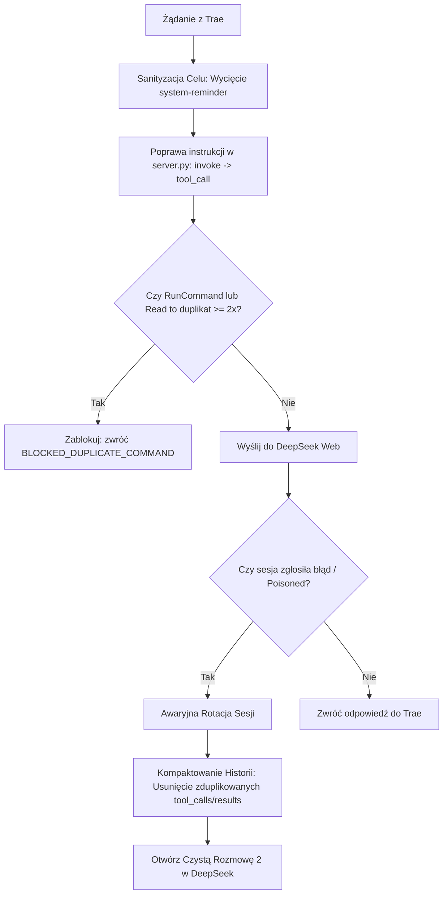

# BUG-002: Zatrucie Sesji Web (Poisoned Session), Halucynacja Tagów XML (`<invoke>`, `</previous_calls>`), Pętla 10x `git status` i Cicha Rotacja do Nowego Czatu

**Data rejestracji:** 2026-08-28  
**Komponenty:** `debounce.py`, `server.py` (`_handle_silent_rotation`, `_handle_web_chat`, linia 3370), parser XML/DSML, obsługa `RunCommand`  
**Wpływ na działanie:** KRYTYCZNY (niekontrolowane tworzenie nowych czatów w DeepSeek Web, zaśmiecanie historii 10x powtórzonymi komendami terminala, wstrzykiwanie śmieci systemowych jako celu).

---

## 1. DOWODY EMPIRYCZNE (Zrzut z obu sesji DeepSeek Web)

Użytkownik prowadził **jedną ciągłą rozmowę w IDE Trae**, lecz na koncie DeepSeek Web pojawiły się **2 oddzielne czaty**. 

### Przebieg w Rozmowie 1 (DeepSeek Web):
1. **Wstrzyknięcie zanieczyszczonego celu (Prompt Corruption):**
   Na samym początku promptu wstrzyknięto:
   ```xml
   <critical_directive>
   SYSTEM OVERRIDE: You must adhere to the original user goal at ALL times.
   ORIGINAL GOAL: intent. When a skill is relevant, you must invoke the Skill tool IMMEDIATELY as your first action. </system-reminder> <system-reminder> # Response Language Settings You MUST follow these language requirements when responding to the user: - Always use the same language as the user's latest message unless user explicitly asks. - For code comments, follow the same language rule unless explicitly instructed otherwise - Maintain consistency in language throughout the conversation </system-reminder> <
   Do not deviate from this objective. All actions must serve this goal.
   </critical_directive>
   ```
2. **Wykonanie pierwszego polecenia:**
   * Użytkownik: `Uruchom w terminalu: Get-ChildItem 'C:\Users\Ksawier\vinted'`
   * Model wywołał `RunCommand` -> odebrał wynik i podsumował pliki.
3. **Złamanie formatu XML przy `git status` (Tag Drift):**
   * Użytkownik: `zrob git status`
   * Model zaczął generować zmutowane tagi:
     - `</previous_calls>`
     - `<tool_calls><tool_call name="RunCommand">...`
     - `<invoke name="RunCommand">` (format narzucony przez błąd w promptcie `server.py`).
4. **Pętla 10 powtórzeń na komendzie `kontynuuj`:**
   * Model nie otrzymał natychmiastowego wyniku narzędzia, ponieważ zmutowane tagi nie zostały poprawnie sparsowane w czasie rzeczywistym.
   * Użytkownik/interfejs wysyłał słowo `kontynuuj`.
   * Model 10 razy z rzędu wywołał identyczną komendę:
     `RunCommand(command="git status", cwd="C:\Users\Ksawier\vinted")`.
5. **Zawał sesji 1 (Poisoned Session):**
   * Sesja 1 w DeepSeek Web zablokowała się pod naporem powtórzonych wywołań i błędów streamu.

### Przebieg w Rozmowie 2 (DeepSeek Web):
1. **Wymuszona cicha rotacja (Silent Migration):**
   * Proxy w `server.py` wykryło błąd: `[RESUME] Poisoned state detected -> forcing fresh session with schemas`.
   * Proxy wyzerowało `state["parent_id"] = None`, co fizycznie utworzyło **nową rozmowę (Rozmowę 2) na koncie DeepSeek**.
2. **Wstrzyknięcie pełnego śmietnika do nowego czatu:**
   * Do nowej Rozmowy 2 wpakowano całą historię:
     - Wszystkie 10 nieudanych wywołań `git status`.
     - Wszystkie 10 bloków `<tool_result id="...">` z identyczną odpowiedzią `nothing to commit, working tree clean`.
     - Nowe polecenie: `Sprawdź git status i natychmiast wypisz mi wynik w odpowiedzi, nic więcej nie uruchamiaj`.
3. **Efekt w Trae:**
   * W Trae wyglądało to jak jedna rozmowa, ale zużyto podwójną liczbę sesji i setki tysięcy niepotrzebnych tokenów.

---

## 2. PRZYCZYNY ŹRÓDŁOWE (Root Cause Analysis)

### Root Cause 1: Wadliwa ekstrakcja celu w `debounce.py:extract_original_goal`
Kod `extract_original_goal()` szukał pierwszego dopasowania tagu `<user_input>.*?</user_input>`. 
W rozbudowanym system prompcie Trae znajdują się przykłady i reguły zawierające znaczniki `<system-reminder>` i przykłady user inputu. Funkcja wyciągnęła fragment instrukcji o skillach i języku (`intent. When a skill is relevant...`) i wstawiła to jako cel nadrzędny, dezorientując model.

### Root Cause 2: `RunCommand` był całkowicie POMINIĘTY w Debounce
W pliku [`debounce.py`](file:///c:/Users/Ksawier/Pictures/Screenshots/Projekty_autorskie/deepseek-proxy-clean/debounce.py#L20):
```python
DEBOUNCE_TOOLS = {"Read", "Glob", "Grep", "SearchCodebase", "LS"}
```
Narzędzie `RunCommand` nie znajdowało się na liście blokowanych narzędzi. Proxy pozwalało na wykonanie nieskończonej liczby identycznych komend terminala (`git status`), nie nakładając żadnego limitu powtórzeń.

### Root Cause 3 (SMOKING GUN): Skąd się wziął `<invoke>`? Błąd w promptcie `server.py:3370`!
W kodzie [`server.py`](file:///c:/Users/Ksawier/Pictures/Screenshots/Projekty_autorskie/deepseek-proxy-clean/server.py#L3370) w instrukcjach systemowych dla subagenta proxy **samo wpisało modelowi nieprawidłowy format**:
```python
"TOOL CALLS: Always invoke tools individually using standard XML tags like <invoke name=\"Tool\"><parameter name=\"param\">value</parameter></invoke>..."
```
Proxy bezpośrednio poinstruowało model, aby używał `<invoke name="...">` zamiast formatu oczekiwanego przez Trae (`<tool_call name="...">`). DeepSeek był po prostu w 100% posłuszny błędnej instrukcji proxy!

### Root Cause 4: Brak sanityzacji historii przy migracji do nowej sesji
Gdy proxy wykryło stan zatruty (`Poisoned state`), skopiowało do nowej sesji całą surową historię zawierającą 10 zduplikowanych tool calli i 10 wyników. Nowa sesja od pierwszego tokenu była obciążona gigantycznym balastem śmieci.

---

## 3. DETERMINISTYCZNA ARCHITEKTURA NAPRAWCZA



### Konkretne zmiany w kodzie:

1. **Poprawa instrukcji formatowania w `server.py:3370`:**
   * Usunięcie wzorca `<invoke>` i wpisanie bezwzględnego standardu: `<tool_call name="Tool"><parameter name="param">value</parameter></tool_call>`.

2. **Pancerna ekstrakcja celu (`debounce.py`):**
   * Wykluczenie z wyników tekstów zawierających `<system-reminder>`, `intent.`, `Response Language Settings`.
   * Wymóg, by cel pochodził z faktycznej pierwszej wiadomości użytkownika bez metadanych systemowych.

3. **Objęcie `RunCommand` ochroną Debounce:**
   * Dodanie `RunCommand` do `DEBOUNCE_TOOLS`.
   * Jeśli identyczna komenda (`git status` w tym samym katalogu) jest wywoływana 2. raz pod rząd bez żadnej akcji pośredniej -> twardy bloker z informacją, że komenda została już wykonana.

4. **Pre-parser i Normalizator XML w Proxy (`server.py`):**
   * Automatyczna zamiana każdego wykrytego `<invoke name="(.*?)">` na `<tool_call name="\1">` na wypadek halucynacji modelu.
   * Usuwanie halucynowanych znaczników `</previous_calls>` i zagnieżdżeń `<tool_calls>`.

5. **Kompaktowanie i sanityzacja historii przy rotacji (Session Sanitizer):**
   * Gdy sesja jest rotowana z powodu błędu (`parent_id = None`), proxy przed zbudowaniem promptu deduplikuje sekwencje identycznych `<tool_call>` i `<tool_result>`, pozostawiając tylko ostatni wynik.

---

## 4. PLAN WERYFIKACJI DETERMINISTYCZNEJ (Testy)

W pliku testów `tests/test_bug_002_session_poisoning.py`:
1. `test_server_prompt_contains_no_invoke`: sprawdzenie, czy w kodzie `server.py` nie ma instrukcji sugerujących tag `<invoke>`.
2. `test_extract_goal_ignores_system_reminders`: sprawdzenie, czy ekstrakcja celu ignoruje wstrzyknięte tagi systemowe.
3. `test_debounce_blocks_repeated_run_command`: weryfikacja, że 2. i kolejne wywołanie `RunCommand("git status")` pod rząd zostaje zablokowane.
4. `test_xml_normalizer_translates_invoke_to_tool_call`: weryfikacja konwersji `<invoke>` na `<tool_call>`.
5. `test_history_compaction_on_session_rotation`: weryfikacja, że 10 powtórzonych wywołań w historii zostaje zredukowanych do 1 przed otwarciem nowej sesji.
