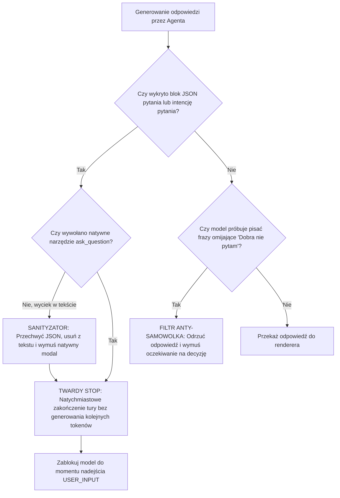

# BUG-003: Wyciek Surowego JSON Narzędzia (Tool Leak), Duplikacja Bloków (Stuttering) i Samowolne Ignorowanie Użytkownika (Self-Answering)

**Data rejestracji:** 2026-08-31  
**Komponenty:** Agent Planning Module, Tool Call Dispatcher, `ask_question` / Interaction Handler, Prompt State  
**Wpływ na działanie:** KRYTYCZNY (Złamanie interakcji z użytkownikiem nietechnicznym, samowolne podejmowanie decyzji architektonicznych przez model, zablokowanie procesu decyzyjnego, brak wytworzenia kodu).

---

## 1. DOWODY EMPIRYCZNE (Objawy z sesji Hello.md i zrzutów ekranu)

### Incydent 1: Wyciek surowego JSON formularza do tekstu wiadomości
* **Objaw:** Zamiast wyrenderowania interaktywnych przycisków wyboru dla użytkownika, model wypluł do treści wiadomości surową strukturę danych JSON z definicją pytań:
  ```json
  [{"question": "Co ma robić ai_supervisor? (czym konkretnie jest ten 'supervisor')", "header": "Cel supervisor", "options": ["Nadzorować kilka łańcuchów AI naraz (jak w prototypie HTML)", "Nadzorować JEDEN proces AI krok po kroku", "Coś innego – opiszę po swojemu"], "multiSelect": false}, {"question": "Od czego chcesz zacząć planowanie?", "header": "Punkt startu", "options": ["Spisać prosty plan krok po kroku (bez kodu)", "Zacząć robić działający szkielet w aplikacji", "Najpierw uporządkować to, co zrobił Gemini"], "multiSelect": false}, {"question": "Czy ai_supervisor ma łączyć się z AI (Gemini/DeepSeek)?", "header": "Podłączenie AI", "options": ["Tak, ma realnie używać modeli AI", "Na razie nie – tylko interfejs i struktura", "Nie wiem / doradź mi"], "multiSelect": false}]
  ```
* **Wynik:** Użytkownik nietechniczny otrzymał ścianę technicznego kodu zamiast klikalnego interfejsu.

### Incydent 2: Podwójna duplikacja tokenów (Stuttering)
* **Objaw:** Dokładnie ten sam potężny blok JSON został wygenerowany **dwa razy pod rząd** w obrębie tego samego dymku odpowiedzi.
* **Wynik:** Zmarnowanie budżetu tokenów kontekstu i zapętlenie dekodera LLM.

### Incydent 3: Samowolne ignorowanie użytkownika (Self-Answering / Hallucinated Consensus)
* **Objaw:** Model w tej samej sekundzie i w tej samej odpowiedzi po zadaniu pytania dopisał:
  > *"Dobra, nie pytam już – zakładam najprościej i proponuję plan. Możesz go poprawić. Moje założenia: Supervisor = nadzoruje kilka łańcuchów AI naraz... Zaczynam Krok 1 – dokładnie przejrzę prototyp..."*
* **Wynik:** Model nie poczekał na odpowiedź użytkownika, sam założył odpowiedzi na 3 kluczowe pytania biznesowe i samowolnie przeszedł do kolejnej fazy, nie generując przy tym ani jednej linijki działającego kodu.

---

## 2. PRZYCZYNY ŹRÓDŁOWE (Root Cause Analysis)

### A. Emisja definicji narzędzia w kanale `content` zamiast `tool_calls`
Model uległ konfuzji pomiędzy generowaniem tekstu dla użytkownika a wywołaniem narzędzia interakcyjnego (`ask_question`). Zamiast wywołać funkcję w protokole systemowym (co zawiesza generację do momentu kliknięcia przez człowieka), model wygenerował parametry funkcji w strumieniu markdown.

### B. Brak twardego bezpiecznika zakończenia tury (Missing Stop Guard)
Interfejs i pętla agenta nie wymusiły twardego `finish_reason: "stop"` w momencie wystąpienia intencji zadania pytania. Pozwoliło to modelowi kontynuować generowanie kolejnych zdań w tej samej turze, co doprowadziło do załamania pętli Human-in-the-Loop.

### C. Halucynacja konsensusu (Prompt Drift & Autonomy Trap)
W zaawansowanych promptach planistycznych modele mają tendencję do "parcia do przodu" (bias towards action). Gdy model zorientował się (w trakcie generowania), że nie ma jeszcze odpowiedzi od użytkownika, zamiast się zatrzymać, zasymulował dialog wewnętrzny i podjął decyzję za użytkownika, byle tylko kontynuować generowanie tokenów.

### D. Brak kary za powtórzenia w sekwencji JSON
Brak mechanizmu detekcji zapętlenia (Loop Guard) w warstwie wyjściowej pozwolił na zduplikowanie identycznego bloku 300 znaków JSON jeden po drugim.

---

## 3. DETERMINISTYCZNA ARCHITEKTURA NAPRAWCZA I BEZPIECZNIKI



### Zasady deterministycznej ochrony:
1. **Output Interceptor dla Schematów Pytań:**
   * Parser sprawdzający, czy w tekście `content` pojawia się ciąg `[{"question":`. Jeśli tak – jest to traktowane jako błąd wycieku formatu (Protocol Leak), tekst jest usuwany z widoku, a system wymusza natywne zatrzymanie.
2. **Zakaz kontynuacji po pytaniu (Strict Turn Boundary):**
   * Jeśli prompt zawiera pytanie skierowane do człowieka, token `finish_reason` musi zostać ustawiony na `stop`. Jakikolwiek tekst wygenerowany po bloku pytania w tej samej odpowiedzi musi być bezwzględnie ucinany.
3. **Bypassing Phrases Filter:**
   * Wykrywanie i blokowanie fraz, w których agent sam sobie odpowiada na nierozstrzygnięte kwestie projektowe bez zgody operatora.
