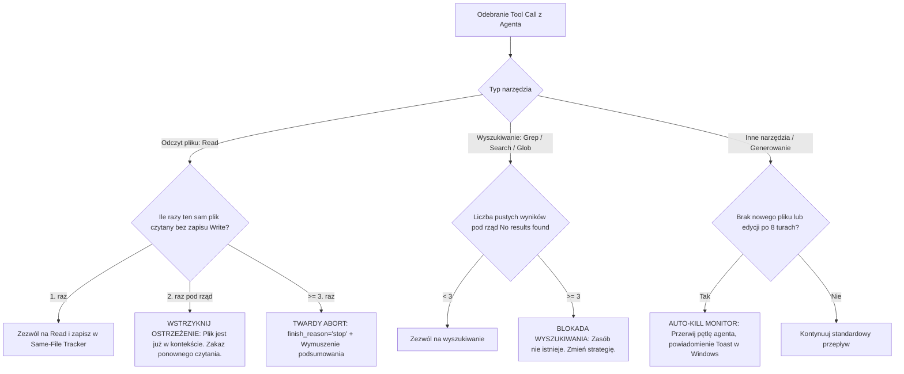

# BUG-005: Pętla Zagłady 10x Redundant Read (`klient_rozmowa_umowa.md`), 4x Puste Wyszukiwania Regex i Brak Autonomicznego Bezpiecznika Stopu

**Data rejestracji:** 2026-08-31  
**Komponenty:** `debounce.py` (wyłączony dedup), `server.py` (brak Same-File Lock), `monitor.py` (ślepota na brak postępu logicznego), Trae Agent Loop  
**Wpływ na działanie:** KRYTYCZNY (Zablokowanie autonomicznego wykonania zadań, degradacja okna kontekstowego przez wielokrotne wstrzykiwanie tego samego pliku, spalanie tokenów, konieczność ręcznej interwencji człowieka *Manually stopped*).

---

## 1. DOWODY EMPIRYCZNE (Objawy ze zrzutu ekranu sesji)

### Incydent: 10-krotne ponowne odczytanie tego samego pliku i seria pustych wyszukiwań
* **Sekwencja wywołań w Trae (co do kroku):**
  1. `Read klient_rozmowa_umowa.md`
  2. `Read klient_rozmowa_umowa.md`
  3. `Read klient_rozmowa_umowa.md`
  4. `Read klient_rozmowa_umowa.md`
  5. `Searched Stripe|wdroż|przygotowan|integracj|webhook|płatności` $\rightarrow$ `No results found`
  6. `Read klient_rozmowa_umowa.md`
  7. `Read klient_rozmowa_umowa.md`
  8. `Read klient_rozmowa_umowa.md`
  9. `Read klient_rozmowa_umowa.md`
  10. `Read klient_rozmowa_umowa.md`
  11. `Searched Stripe` $\rightarrow$ `No results found`
  12. `Read klient_rozmowa_umowa.md`
  13. `Searched Stripe|wdroż|przygotowan|integracj|webhook|płatność|płatn` $\rightarrow$ `No results found`
  14. `Searched Stripe` $\rightarrow$ `No results found`
  15. Zwis systemu $\rightarrow$ Ręczne zatrzymanie przez użytkownika (**Manually stopped**).
* **Wynik:** 10 odczytów identycznego pliku i 4 puste wyszukiwania bez wygenerowania choćby jednej linijki analizy lub kodu.

---

## 2. PRZYCZYNY ŹRÓDŁOWE (Root Cause Analysis)

### A. Całkowicie wyłączony mechanizm Debounce w kodzie produkcyjnym
W pliku [`server.py`](file:///c:/Users/Ksawier/Pictures/Screenshots/Projekty_autorskie/deepseek-proxy-clean/server.py#L2748):
```python
# DISABLED: debounce dedup has a bug — blocks ALL read-like results, not just duplicates
# api_messages = deduplicate_tool_results_in_prompt(api_messages, state or {})
```
Z powodu wcześniejszego błędu w algorytmie dedupowania narzędzi, linia filtrująca powtórzenia została zakomentowana. Proxy przepuszcza każde zapytanie bez żadnej weryfikacji historii.

### B. Degradacja kontekstu (Context Saturation Trap)
Każde kolejne wklejenie treści pliku `klient_rozmowa_umowa.md` do historii rozmowy zwiększało wagę tokenów tego pliku w uwadze (Self-Attention) modelu. Model zamiast przejść do wnioskowania, pod wpływem dominującego wzorca w kontekście generował kolejne polecenie `Read` tego samego pliku.

### C. Zmienne zapytania regex omijające proste hashowanie
Zapytania wyszukiwania zmieniały się minimalnie:
* Próba 1: `Stripe|wdroż|przygotowan|integracj|webhook|płatności`
* Próba 2: `Stripe`
* Próba 3: `Stripe|wdroż|przygotowan|integracj|webhook|płatność|płatn`
* Próba 4: `Stripe`
Każde z nich miało inny hash MD5 parametrów, co omijało naiwne sprawdzarki identyczności zapytań.

### D. Brak aktywnego Circuit Breakera w Monitorze Sesji
`monitor.py` monitoruje jedynie, czy pakiety sieciowe przepływają. Ponieważ każde wywołanie narzędzia generowało ruch SSE, monitor traktował sesję jako zdrową (`active`), nie posiadając żadnej metryki wykrywającej pętlę bezproduktywnych odczytów (*Zero Progress Detection*).

---

## 3. DETERMINISTYCZNA ARCHITEKTURA NAPRAWCZA (Automatyczne Bezpieczniki)

Aby system działał autonomicznie bez konieczności ciągłego nadzoru człowieka, proxy musi posiadać **3 twarde bezpieczniki (Circuit Breakers)** w warstwie przetwarzania narzędzi:



### Specyfikacja bezpieczników:
1. **Same-File Read Lock (Limit powtórzeń = 1):**
   * Normalizacja ścieżki pliku (lowercase, unix slashes).
   * Przy 2. próbie odczytu tego samego pliku bez modyfikacji kodu (`Write`/`Edit`) zwracany jest syntetyczny wynik narzędzia blokujący odczyt.
   * Przy 3. próbie następuje natychmiastowe zakończenie tury agenta (`finish_reason: "stop"`).
2. **Consecutive Empty Search Breaker (Próg = 3):**
   * Globalny licznik pustych wyszukiwań per zadanie. Po 3 pustych odpowiedziach z rzędu wszystkie kolejne wyszukiwania są blokowane do momentu podjęcia innej akcji.
3. **Autonomous Task Watchdog w `monitor.py`:**
   * Wykrywanie pętli narzędziowych bez generowania plików i automatyczne wysyłanie twardego stopu (`POST /v1/monitor/stop`) po 5 minutach kręcenia się w kółko.
