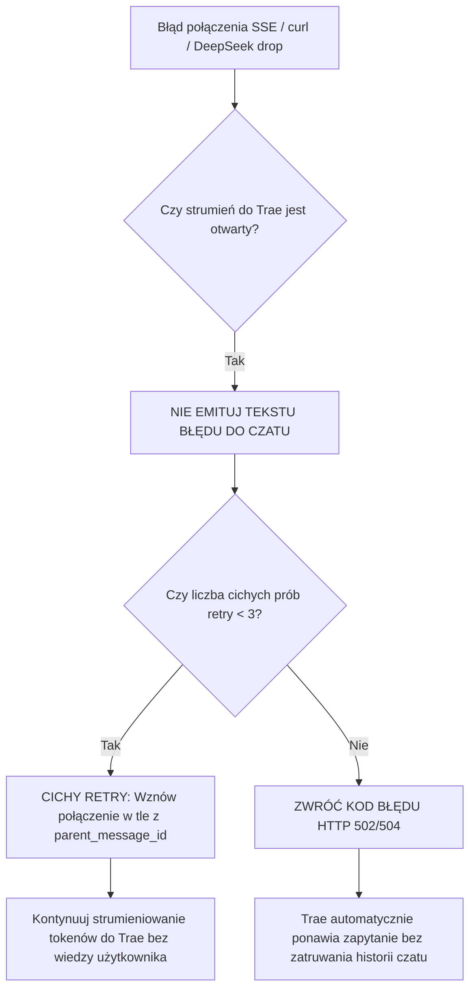

# BUG-006: Podwójne Kaskadowe Zerwanie Strumienia (Double Cascade Stream Abort), Wstrzykiwanie Błędów do Kontekstu i Rozbicie Maszyny Stanów Subagenta

**Data rejestracji:** 2026-08-31  
**Komponenty:** `server.py` (`_stream_source`, `_chat_completions_impl`, Fallback Error Injector L3914), DeepSeek Web SSE Gateway, Trae Subagent Dispatcher  
**Wpływ na działanie:** KRYTYCZNY (Dwukrotne przerwanie sesji z rzędu, zatrucie historii czatu komunikatami systemowymi, rozbicie pętli podagenta *Search Agent*, zmuszenie użytkownika do ręcznego wpisywania *kontynuuj* w pętli awarii).

---

## 1. DOWODY EMPIRYCZNE (Objawy ze zrzutu ekranu sesji)

### Incydent: Podwójne kaskadowe urwanie odpowiedzi i pętla "kontynuuj"
* **Krok 1 (Pierwsze zerwanie):**
  * Użytkownik zlecił zadanie planowania i eksploracji architektury Cortexa.
  * Uruchomił się podagent: `Search Agent | Zbadaj strukturę renderer Cortex`.
  * Po odczytaniu 5 plików nastąpiło zerwanie połączenia sieciowego z backendem DeepSeek.
  * Proxy zamiast błędu protokołu HTTP wyemitowało do dymka subagenta tekst:
    > `*Stream został przerwany przez DeepSeek. Wyślij 'kontynuuj' aby dokończyć — kontekst został zachowany.*`
* **Krok 2 (Reakcja użytkownika i zatrucie kontekstu):**
  * Użytkownik wpisał w czacie polecenie: `kontynuuj`.
* **Krok 3 (Drugie zerwanie z rzędu):**
  * Agent główny wznowił pracę ze zniekształconym kontekstem:
    `Sprawdzam strukturę kodu i komponent NotesCanvas... src/**/* ... Read 1 file >`
  * Strumień urwał się **po raz drugi z rzędu** przed ukończeniem generowania.
* **Krok 4 (Trzecie "kontynuuj" i zwis w fazie myślenia):**
  * Użytkownik po raz drugi wpisał `kontynuuj`.
  * Agent wszedł w permanentny stan `AI thinking` (zamrożenie na rozważaniu zanieczyszczonej historii).

---

## 2. PRZYCZYNY ŹRÓDŁOWE (Root Cause Analysis)

### A. Wstrzykiwanie tekstu błędu do kanału wyjściowego LLM (`server.py:L3914`)
W bloku obsługi wyjątków generatora SSE:
```python
except Exception as e:
    ...
    yield _chunk({"content": "\n\n*Stream został przerwany przez DeepSeek. Wyślij 'kontynuuj' aby dokończyć — kontekst został zachowany.*"})
    yield "data: [DONE]\n\n"
    return
```
Proxy traktuje błędy transportu sieciowego jako zwykłe tokeny `content` modelu. W efekcie:
1. Trae interpretuje błąd jako poprawną, sfinalizowaną odpowiedź asystenta.
2. Komunikat techniczny zostaje na stałe dopisany do historii konwersacji w pamięci bota.

### B. Rozbicie kontraktu Tool-Calling w Subagencie
Gdy `Search Agent` wykonuje eksplorację kodu, Trae oczekuje tokenów w formacie `tool_calls`. Otrzymanie czystego tekstu w formacie markdown powoduje, że Trae przedwcześnie zamyka instancję subagenta, porzucając rozpoczęte procedury odczytu plików.

### C. Kaskadowa degradacja kontekstu (Double Failure Cascade)
Gdy użytkownik wpisuje `kontynuuj` po raz pierwszy, model otrzymuje w historii:
* `Assistant`: *Stream został przerwany...*
* `User`: *kontynuuj*
Model traci pewność co do pierwotnego celu zadania i zaczyna zachowywać się niestabilnie, co zwiększa prawdopodobieństwo kolejnego błędu (w tym wypadku natychmiastowego drugiego zerwania i zacięcia w fazie `AI thinking`).

### D. Brak mechanizmu Transparent Reconnect (Cichego wznowienia)
Proxy po napotkaniu błędu sieciowego natychmiast poddaje się i zamyka strumień (`yield "data: [DONE]"`), zamiast utrzymać otwarte połączenie SSE do Trae i podjąć 1-2 próby transparentnego ponowienia żądania do DeepSeeka w tle.

---

## 3. DETERMINISTYCZNA ARCHITEKTURA NAPRAWCZA



### Zasady deterministycznej ochrony:
1. **Całkowity zakaz wstrzykiwania komunikatów tekstowych (No Text Error Injection):**
   * Usunięcie linijek `yield _chunk({"content": "*Stream został przerwany...*"})`. Awaria sieci nie może być częścią promptu konwersacji.
2. **Transparent Auto-Resume w `_stream_source`:**
   * W przypadku błędu sieciowego proxy wysyła do Trae puste pakiety podtrzymujące (`: ping`), podczas gdy w tle natychmiast próbuje nawiązać nowe połączenie i dokleić brakujące tokeny.
3. **Prawidłowa propagacja kodów błędów HTTP (502/504):**
   * Jeśli błędu nie da się naprawić w locie, proxy musi zakończyć żądanie statusem HTTP `502 Bad Gateway`, co wymusza w Trae natywne ponowienie żądania (przycisk *Retry*) bez modyfikowania historii promptu.
