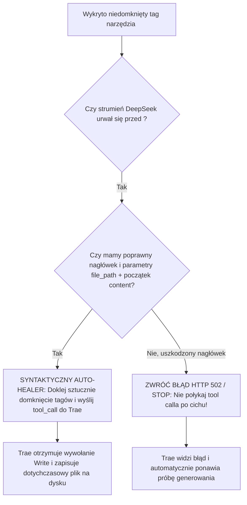

# BUG-007: Połknięcie Niedomkniętego Tool-Calla (`Write`), Przedwczesne Zakończenie Strumienia i Pozorny Sukces Tekstowy (Ghost Execution)

**Data rejestracji:** 2026-08-31 20:11  
**Komponenty:** `server.py` (`_stream`, `_has_unclosed_tool_call`, `_STRIP_TAGS`, Crash Dump Logger), DeepSeek Web SSE Parser  
**Wpływ na działanie:** KRYTYCZNY (Model deklaruje wykonanie zapisu pliku, ale narzędzie zostaje bezpowrotnie odrzucone przez proxy; Trae otrzymuje fałszywy status zakończenia wypowiedzi bez wywołania narzędzia dyskowego).

---

## 1. DOWODY EMPIRYCZNE (Objawy ze zrzutu ekranu i zrzutu awarii crash dump)

### Incydent: Zakończenie wypowiedzi z obietnicą zapisu, bez wykonania operacji
* **Objaw w Trae (ze zrzutu ekranu):**
  * Czas pracy: `Worked for 4m 11s`.
  * Treść w dymku asystenta:
    > `Mam pełny obraz obu projektów. Zaczynam naprawy modułu supervisor. Najpierw types.ts.`
  * Wynik w Trae: Generowanie natychmiastowo się zakończyło (kółko postępu zniknęło, pojawił się pasek reakcji i input), **ale żaden plik nie został zapisany ani zmodyfikowany**.

### Twardy dowód ze zrzutu awaryjnego (`data/crashed_chats/crash_20260831_201039_jwt_leg_caoy_7384b518.md`)
```markdown
# Crash dump 20260831_201039
- conv_key: jwt_leg_caoyunxiang_7f246e90
- session_id: 7384b518-7a44-4509-a65a-5f93b9b8ee10
- account_idx: 3
- reason: unclosed tool call aborted before completion

## Partial content:
Mam pełny obraz obu projektów. Zaczynam naprawy modułu supervisor. Najpierw `types.ts`.

<｜｜DSML｜｜tool_calls>
<｜｜DSML｜｜invoke name="Write">
<｜｜DSML｜｜parameter name="file_path" string="true">C:\Users\Ksawier\Pictures\Screenshots\Projekty_autorskie\cortex-app\src\supervisor\types.ts</｜｜DSML｜｜parameter>
<｜｜DSML｜｜parameter name="content" string="true">// ============================================================================
// CORTEX — AI Supervisor Data Types (Zero-Mock, Real Execution Model)
// Zgodne ze standardem schema.json
// =========================================================================
```

---

## 2. PRZYCZYNY ŹRÓDŁOWE (Root Cause Analysis)

### A. Ucięcie strumienia w trakcie generowania treści pliku
Model DeepSeek rozpoczął prawidłowe wywołanie narzędzia zapisu `Write` do ścieżki `src/supervisor/types.ts`. W trakcie generowania właściwego kodu TypeScript w parametrze `content`, webowy backend DeepSeek przedwcześnie zamknął strumień chunków SSE (przekroczenie okna odpowiedzi lub timeout sieci).

### B. Nieudane Auto-Continue i porzucenie niedomkniętego tagu
Proxy wykryło stan `_has_unclosed_tool_call` i podjęło próbę `AUTO-CONTINUE`. Gdy próba się nie powiodła (lub została przerwana):
1. Proxy uznało narzędzie za uszkodzone/niedomknięte (`unclosed tool call aborted`).
2. Zapisało zrzut do katalogu `crashed_chats/`.

### C. Ciche wycięcie tagu DSML i fałszywy status `[DONE]`
Zamiast zgłosić do Trae błąd wykonania lub wymusić dokończenie:
1. Funkcja sanitizera usunęła cały niesparsowany blok `<｜｜DSML｜｜invoke...>` z bufora wyjściowego (jako surowy tag XML).
2. Do Trae wysłano jedynie czysty tekst preambuły: *"Mam pełny obraz obu projektów. Zaczynam naprawy modułu supervisor. Najpierw types.ts."*.
3. Proxy wyemitowało znacznik `data: [DONE]`.
4. Trae uznało turę za w 100% udaną odpowiedź tekstową i oddało głos użytkownikowi.

---

## 3. DETERMINISTYCZNA ARCHITEKTURA NAPRAWCZA



### Zasady deterministycznej ochrony:
1. **Zakaz cichego połykania niedomkniętych narzędzi (*No Silent Tool Dropping*):**
   * Jeśli w buforze znajduje się poprawny początek `<invoke name="...">`, proxy **nigdy nie może** zamknąć strumienia jako czystego tekstu. 
2. **Syntaktyczny Auto-Healer (Domykanie tagów w locie):**
   * Jeśli model wygenerował już poprawny parametr `file_path` i znaczną część kodu w `content`, proxy zamiast porzucać cały plik, automatycznie dokleja:
     `</｜｜DSML｜｜parameter></｜｜DSML｜｜invoke></｜｜DSML｜｜tool_calls>`
     i przekazuje wywołanie narzędzia `Write` do Trae.
3. **Jawna sygnalizacja błędu w przypadku nieodwracalnego uszkodzenia:**
   * Jeśli tagu nie da się uratować – rzucenie wyjątku sieciowego `502`, a nie wysyłanie pustego `[DONE]`.
