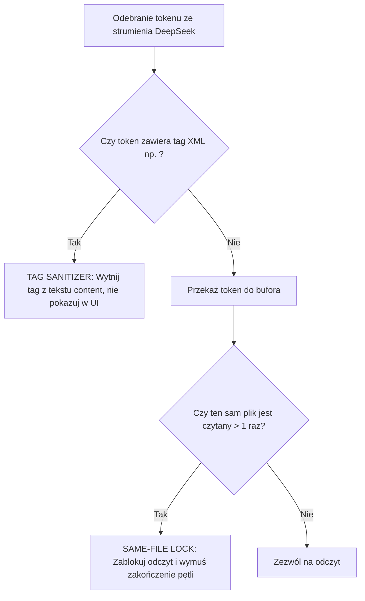

# BUG-010: Wyciek Tagu XML `</previous_calls>` do Kanału Tekstowego, Pętla 9x Redundant Read (`Ocena modułu Supervisor.md`) i Puste Wyszukiwanie Regex

**Data rejestracji:** 2026-08-31 20:20  
**Komponenty:** `server.py` (`_STRIP_TAGS`, Tag Sanitizer, Debounce Hook), Trae Reference Injection (`@file`), DeepSeek Token Stream  
**Wpływ na działanie:** KRYTYCZNY (Wyciek wewnętrznych tagów protokołu do interfejsu użytkownika, natychmiastowe wejście w pętlę 9-krotnego odczytu tego samego pliku markdown, zawieszenie generowania na 0%).

---

## 1. DOWODY EMPIRYCZNE (Objawy ze zrzutu ekranu)

### Incydent 1: Wyciek surowego tagu zamykającego `</previous_calls>`
* **Tekst asystenta w czacie Trae:**
  ```text
  Reference >
  Read 1 file >
  </previous_calls>
  ```
* **Wynik:** Tag protokołu formatowania historii narzędzi (`</previous_calls>`) wyciekł jako zwykły tekst markdown do dymka odpowiedzi.

### Incydent 2: Pętla 9x ponownego odczytu tego samego pliku
* **Sekwencja narzędzi (Read 9 files, Searched files 1 time):**
  1. `Read Ocena modułu Supervisor.md`
  2. `Read Ocena modułu Supervisor.md`
  3. `Read Ocena modułu Supervisor.md`
  4. `Read Ocena modułu Supervisor.md`
  5. `Read Ocena modułu Supervisor.md`
  6. `Read Ocena modułu Supervisor.md`
  7. `Read Ocena modułu Supervisor.md`
  8. `Read Ocena modułu Supervisor.md`
  9. `Read Ocena modułu Supervisor.md`
  10. `Found 49 lines ^#{1,3}` $\rightarrow$ `No results found`
* **Wynik:** Model po raz kolejny zapętlił się w schemacie *Doom Loop*, czytając 9 razy plik podsumowania zamiast podjąć jakąkolwiek akcję inżynierską.

---

## 2. PRZYCZYNY ŹRÓDŁOWE (Root Cause Analysis)

### A. Nieszczelność filtra tagów XML w `server.py` (`_STRIP_TAGS`)
Wzorzec wyrażeń regularnych usuwających tagi systemowe nie uwzględniał tagu `</previous_calls>` (używanego w historii rozmów przez Trae/OpenAI format). Gdy model wyemitował ten tag w fazie RESPONSE, proxy uznało go za zwykły tekst i przepchnęło bezpośrednio do interfejsu użytkownika.

### B. Niejasny / Otwarty prompt (*"kontynuuj cokolwiek on robil"*)
Użytkownik podpiął referencję `[Ocena modułu Superviso...]` i podał ogólnikową instrukcję. W sytuacji braku twardego celu zadania, model z powodu halucynacji bezpieczeństwa wszedł w pętlę wielokrotnego czytania podpiętego dokumentu.

### C. Brak aktywnego bezpiecznika Same-File Lock (Brak wdrożenia BUG-001/005)
Ponieważ bezpieczniki `Same-File Read Lock` (zgodnie z BUG-001 i BUG-005) nadal nie zostały włączone w kodzie produkcyjnym `server.py`, proxy bezkrytycznie przepuszcza 9 identycznych wywołań `Read` z rzędu.

---

## 3. DETERMINISTYCZNA ARCHITEKTURA NAPRAWCZA



### Zasady deterministycznej ochrony:
1. **Rozszerzenie filtra `_STRIP_TAGS`:**
   * Objęcie filtrem wyrażeń regularnych wszystkich tagów protokołowych: `</?previous_calls>`, `</?invoke>`, `</?parameter>`, `</?tool_call>`, `</?function_calls>`.
2. **Aktywacja twardego Same-File Lock w `server.py`:**
   * Bezwzględne zablokowanie możliwości czytania tego samego pliku więcej niż 1 raz pod rząd bez modyfikacji kodu.
