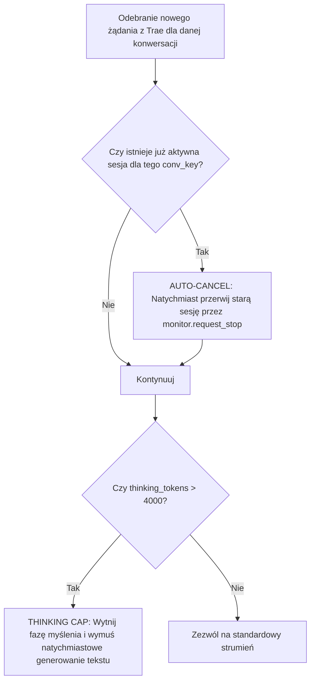

# BUG-017: Zombifikacja Sesji Współbieżnych na Jednym Koncie (`acc: 0`), Przepalenie 35k+ Tokenów w Ukrytym Myśleniu i Całkowity Paraliż Czatu

**Data rejestracji:** 2026-09-01 15:33  
**Komponenty:** `server.py` (`_slot_busy`, Session Concurrency, Orphan Session Cleaner), DeepSeek-R1 Thinking Engine, Trae UI  
**Wpływ na działanie:** KRYTYCZNY (Model wszedł w gigantyczną pętlę myślenia >13 000 tokenów trwającą prawie 8 minut; wysłanie ponownego promptu uruchomiło drugą, równoległą sesję na tym samym koncie, doprowadzając do kolizji dwóch strumieni, przepalenia 35 000 tokenów i paraliżu interfejsu).

---

## 1. DOWODY EMPIRYCZNE (Objawy ze zrzutu ekranu i monitora sesji na żywo)

### Incydent 1: Pozorny zwis w Trae na statusie "AI thinking"
* **Poprzedni stan:** Model napisał zdanie:
  > `Mam kilka decyzji do ustalenia, bo od nich zależy cały projekt funkcji.`  
  > `Zbieram teraz konkretne szczegóły techniczne potrzebne do planu: jak działa viewport/camera canvasu...`
* **Akcja użytkownika:** Uznając, że model się zawiesił, użytkownik wysłał ponaglenie:
  > `siema skonczyles na kilka deycji do ustalenia, wiec kontynuuj co masz`
* **Objaw po wysłaniu:** Agent wpadł w permanentne `AI thinking` i mieli w nieskończoność.

### Incydent 2: Twarde dowody z monitora sesji (`data/sessions_monitor.json`)
W momencie diagnozy na koncie `acc: 0` działały **WSPÓŁBIEŻNIE DWIE GIGANTYCZNE SESJE-ZOMBIE**:
```json
[0] session_id: 4c9d9dd2... acc: 0 | state: active | tokens: 27 902 | thinking: 13 191 | age: 458.7s (7.6 minuty!)
[1] session_id: 9eb34f44... acc: 0 | state: thinking | tokens: 7 184 | thinking: 3 758 | age: 164.9s (2.7 minuty!)
```
* **Łącznie przepalone tokeny:** **35 086 tokenów** (w tym **16 949 tokenów myślenia** w ukryciu).
* **Kolizja:** Obie sesje odpytywały tę samą konwersację (`jwt_leg_caoyunxiang_3113`) na jednym darmowym koncie webowym.

---

## 2. PRZYCZYNY ŹRÓDŁOWE (Root Cause Analysis)

### A. Eksplozja Fazy Myślenia (*R1 Thinking Explosion*)
DeepSeek-R1 przy szerokim pytaniu o architekturę Canvasu i notatek wszedł w gigantyczny proces wnioskowania (13k tokenów). Ponieważ proxy filtruje tokeny myślenia i nie wysyła ich do Trae (aby nie zaśmiecać widoku asystenta), Trae wyświetlało jedynie pulsujący napis `AI thinking`. Dla użytkownika wyglądało to na 100% zwis.

### B. Brak ubijania poprzedniej sesji przy nowym żądaniu (*Orphan Session Leak*)
Gdy użytkownik wysłał nowy prompt w trakcie trwania poprzedniej generacji:
1. Proxy **nie przerwało** trwającej sesji `4c9d9dd2`.
2. Proxy otworzyło **nowy wątek `9eb34f44` do tego samego czatu DeepSeeka**.
3. Dwa procesy zaczęły współzawodniczyć o generowanie odpowiedzi na jednym koncie, blokując wzajemnie pakiety SSE i doprowadzając do paraliżu.

### C. Działanie naprawcze w locie:
Wysłano twardy sygnał zatrzymania (`POST /v1/monitor/stop`) dla obu sesji, uwalniając konto `acc: 0` z blokady.

---

## 3. DETERMINISTYCZNA ARCHITEKTURA NAPRAWCZA



### Zasady deterministycznej ochrony:
1. **Single-Active-Session Lock per Conversation:**
   * Wysłanie nowej wiadomości w Trae musi **automatycznie i bezwzględnie ubijać poprzednią wiszącą sesję** w proxy.
2. **Thinking Cap (Ogranicznik myślenia na 4000 tokenów):**
   * Jeśli faza myślenia przekroczy 4k tokenów bez wygenerowania ani jednego słowa odpowiedzi, proxy ucina strumień myślenia i zmusza model do przejścia do odpowiedzi właściwej.
