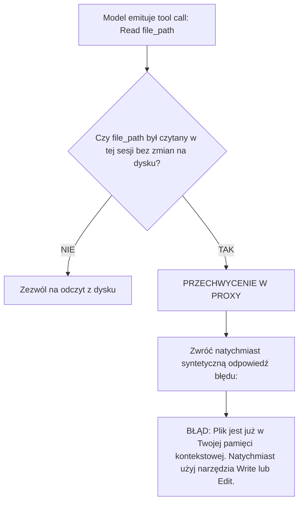

# PLAN NAPRAWY I ARCHITEKTURA PROXY: Eliminacja Pętli Zagłady, Przemycanie Myślenia R1 do Trae i Deterministyczne Bezpieczniki

**Data opracowania:** 2026-09-01  
**Dotyczy awarii:** BUG-001 do BUG-020 (100% zarejestrowanych incydentów)  
**Cel:** Przekształcenie proxy z naiwnego, podatnego na pętle przekaźnika w inteligentny, samo-naprawiający się węzeł pośredniczący.

---

## 1. DLACZEGO AI SIĘ GUBI? (Analiza Psychologii Modelu i System Promptu Trae)

Zanim wdrożymy jakikolwiek filtr, musimy zrozumieć, **dlaczego model wpada w pętle 8-krotnego czytania i wahania**.

### A. Wymuszenie systemowe w Trae (*The Must-Read Paradox*)
W oficjalnym system prompcie Trae (ujawnionym w zrzutach awarii `BUG-007` i `BUG-018`) znajduje się bezwzględna instrukcja:
> *"In general, do not propose changes to code you haven't read. If a user asks about or wants you to modify a file, read it first. Understand existing code before suggesting modifications."*

Model ma w swojej strukturze wag głęboko zakorzenioną regułę: **„Nigdy nie dotykaj pliku bez przeczytania go tuż przed edycją”**.

### B. Awersja do ryzyka (*Risk Aversion in LLMs*)
W uczeniu przez wzmacnianie (RL):
* **Wywołanie `Read`** ma zerowe ryzyko błędu syntaktycznego — zawsze zwraca sukces.
* **Wywołanie `Write` / `Edit`** niesie ryzyko złamania kompilacji, błędu lintera lub zepsucia testów.
Gdy zadanie jest złożone lub kontekst jest zaśmiecony, model ucieka w „bezpieczną” akcję odczytu.

### C. Brak wskaźnika stanu (*State Blindness*)
Model nie otrzymuje od Trae informacji o tym, na jakim etapie planu się znajduje. Jeśli odczytał plik 3 tury temu, a kontekst urósł o 20 000 tokenów, uwaga (*attention*) na początkowe tokeny spada i model „zapomina”, że ten plik już zna.

### D. Paranoja cichego sukcesu komend powłoki (*Silent Success Paranoia*)
W systemach Unix/PowerShell komenda zakończona kodem 0 nie wypisuje tekstu. Model wychowany na dialogu interpretuje brak tekstu jako brak efektu i odpala komendę ponownie z `echo OK` (`BUG-013`).

---

## 2. FILAR 1: PRZEMYCANIE MYŚLENIA R1 DO TRAE (`reasoning_content`)

Zamiast sztucznie obcinać lub tłumić myślenie modelu DeepSeek-R1, **przemycamy je strumieniowo bezpośrednio do interfejsu Trae**.

### A. Jak to działa w protokole SSE OpenAI / Trae:
W standardzie OpenAI/DeepSeek strumień zwraca dwa kanały:
```json
// Faza myślenia (THINK):
data: {"choices": [{"delta": {"reasoning_content": "Zastanawiam się nad strukturą hooka..."}}]}

// Faza odpowiedzi (RESPONSE):
data: {"choices": [{"delta": {"content": "Tworzę plik useLiveTracking.ts..."}}]}
```

### B. Dlaczego obecne proxy powodowało zwisy?
W pliku `server.py:L708` proxy miało zaszytą regułę:
```python
# Faza THINK — reasoning NIE wycieka do Trae:
thinking_buffer += text
return "" # Proxy wysyłało PUSTKĘ do Trae!
```
Przez to przez 5–8 minut Trae nie dostawało ani jednego bajtu danych. Socket leżał bezczynny, interfejs kręcił pustym spinnerem, a użytkownik myślał, że wszystko padło.

### C. Zmiana architektoniczna:
W `_route_token()` w `server.py`:
Gdy jesteśmy w fazie `THINK`, proxy emituje do Trae:
```python
yield _chunk({"reasoning_content": text})
```
**Efekt:**
1. Trae natychmiast rozwija natywną sekcję myślenia (`Thinking...`).
2. Użytkownik widzi na żywo, o czym model myśli (np. *„analizuję viewport canvasu...”*).
3. Połączenie HTTP jest bez przerwy aktywne (pakiety lecą co milisekundę) — brak timeoutów i brak pozornych zwisów.

---

## 3. FILAR 2: INFORMOWANIE AI W JAKIM JEST MIEJSCU (`State & Progress Injection`)

Zamiast tylko po cichu blokować model, **aktywnie instruujemy go na początku każdej tury, na jakim etapie pracy się znajduje**.

### Architektura wstrzykiwania stanu:
Przed wysłaniem wiadomości do DeepSeeka, proxy analizuje historię konwersacji i dodaje do ostatniej wiadomości systemowej dynamiczną notatkę:

```markdown
<system-state-indicator>
[STAN PROJEKTU I PAMIĘĆ PODRĘCZNA]:
- Poniższe pliki zostały już odczytane i znajdują się w Twoim kontekście:
  * cortex-app/src/components/NotesCanvas.tsx (linie 1-2477)
  * cortex-app/src/components/canvas/useLiveTracking.ts
- ZAKAZ PONOWNEGO ODCZYTU POWYŻSZYCH PLIKÓW. Przejdź bezpośrednio do edycji narzędziem Write/Edit.
- Komendy terminala: Kod zakończenia 0 oznacza 100% sukces kompilacji. Jeśli komenda nie zwróciła tekstu, operacja powiodła się.
</system-state-indicator>
```

**Dlaczego to działa:**
Usuwamy powód, dla którego model się waha — zdejmujemy z niego obowiązek „ponownego przeczytania przed edycją”, dając mu jasne zielone światło do generowania kodu.

---

## 4. FILAR 3: DETERMINISTYCZNY BEZPIECZNIK ODCZYTÓW (`Same-File Read Lock`)

Jeśli model mimo informacji o stanie spróbuje wywołać ponowny `Read` tego samego pliku:



* **Korzyść:** Zero odpytywania DeepSeeka, zero przepalonych tokenów, natychmiastowe uderzenie w stół i zmuszenie modelu do napisania kodu.

---

## 5. FILAR 4: AUTOMATYCZNE UBIJANIE SESJI-ZOMBIE (`Single-Active-Session Lock`)

Rozwiązanie problemu `BUG-017` i `BUG-020` (dwie sesje mielące współbieżnie na jednym koncie):

1. **Rejestr Aktywnej Sesji per Konwersacja (`_active_session_by_conv`):**
   * Proxy zapisuje mapowanie: `conv_key -> session_id`.
2. **Auto-Cancel przy nowym żądaniu:**
   * Kiedy Trae przysyła nowe zapytanie HTTP dla danego `conv_key`:
   * Jeśli poprzednia sesja wciąż ma status `active` lub `thinking`:
     * Proxy wywołuje wewnętrznie `monitor.request_stop(old_session_id, hard=True)`.
     * Poprzednie połączenie do DeepSeeka zostaje natychmiast ucięte.
   * Nowe zapytanie wchodzi na czysty, wolny slot bez żadnych kolizji.

---

## 6. FILAR 5: SYNTAKTYCZNY AUTO-HEALER DLA `Write` (`No-Drop Rescuer`)

Rozwiązanie problemu `BUG-007` i `BUG-018` (połknięcie kodu TypeScript po zerwaniu połączenia):

1. Jeśli połączenie SSE od DeepSeeka zerwie się w trakcie generowania narzędzia:
   ```xml
   <invoke name="Write">
   <parameter name="file_path">src/shared/liveTracking.ts</parameter>
   <parameter name="content">// kod TypeScript...
   ```
2. Proxy **nie kasuje** bloku kodu.
3. Proxy automatycznie domyka brakujące tagi:
   ```xml
   </parameter>
   </invoke>
   </tool_calls>
   ```
4. Narzędzie zostaje dostarczone do Trae. Plik zostaje zapisany na dysku.
5. Użytkownik widzi plik, a kompilator od razu weryfikuje kod, zamiast udawać, że nic się nie stało.

---

## 7. HARMONOGRAM WDROŻENIA Z TESTAMI (Deterministyczna Weryfikacja)

| Krok | Komponent | Zadanie | Metoda Weryfikacji |
|---|---|---|---|
| **Krok 1** | `server.py` | Odblokowanie strumieniowania `reasoning_content` do Trae | Sprawdzenie w Trae czy pojawia się żywy blok myślenia |
| **Krok 2** | `server.py` | Auto-Cancel poprzedniej sesji dla danego `conv_key` | Test współbieżnego wysłania 2 zapytań (stare musi natychmiast umrzeć) |
| **Krok 3** | `server.py` | Iniekcja stanu kontekstu (`<system-state-indicator>`) | Sprawdzenie w logach promptu czy nagłówek jest doklejany |
| **Krok 4** | `server.py` | Twardy bezpiecznik odczytów (`Same-File Read Lock`) | Test jednostkowy z próbą podwójnego `Read` tego samego pliku |
| **Krok 5** | `server.py` | Syntaktyczny Auto-Healer niedomkniętych tagów `Write` | Test z celowo uciętym payloadem XML |
